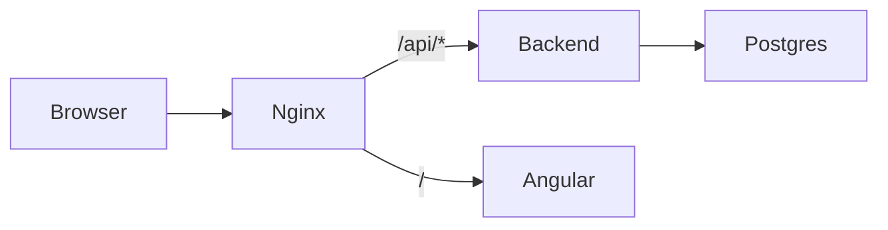

# Setup Match

IT equipment inventory and role-based allocation for operations teams.

**Repository:** https://github.com/tomaszs/setupmatch (private)

## Quick start

Prerequisites: Docker Desktop (or Docker Engine + Compose v2).

```powershell
cd setupmatch
docker compose up --build
```

| Service | URL |
|---------|-----|
| Frontend (ops UI) | http://localhost:4200 |
| Backend API | http://localhost:8080 |
| Swagger UI | http://localhost:8080/swagger-ui.html |
| Postgres | localhost:5432 (user/password/db: `setupmatch`) |

Seed data loads automatically via Flyway (`V2__seed.sql`): 15 items across all four equipment types.

Copy `.env.example` to `.env` to override compose defaults. Demo credentials only, not for production.

### Run tests locally

Backend (requires JDK 21 and Postgres). Easiest path: start test Postgres, then run Gradle in Docker:

```powershell
docker compose -f docker-compose.test.yml up -d --wait
docker run --rm -v "${PWD}/backend:/app" -w /app `
  -e SPRING_DATASOURCE_URL=jdbc:postgresql://host.docker.internal:5433/setupmatch `
  -e SPRING_DATASOURCE_USERNAME=setupmatch -e SPRING_DATASOURCE_PASSWORD=setupmatch `
  eclipse-temurin:21-jdk-alpine ./gradlew test --no-daemon
```

With JDK 21 on the host and Postgres on port 5432:

```powershell
cd backend
./gradlew test
```

Frontend unit tests (requires Node 22+):

```powershell
cd frontend
npm ci
npm test -- --watch=false --browsers=ChromeHeadless
```

E2E (requires the Docker stack running on http://localhost:4200):

```powershell
docker compose up -d --wait
cd e2e
npm ci
npx playwright install chromium
npm test
```

### Run frontend locally (optional)

Requires Node 22+ and a running backend (or Docker stack):

```powershell
cd frontend
npm install
npm start
```

With `ng serve`, configure a dev proxy or run the full Docker stack so `/api` resolves.

## Architecture



| Layer | Stack |
|-------|-------|
| Database | PostgreSQL 16, Flyway migrations |
| Backend | Java 21, Kotlin, Spring Boot 3.4, JPA, Validation, Actuator, Springdoc |
| Frontend | Angular 19, Angular Material, nginx reverse proxy |
| API format | JSON, snake_case field names |

**Backend packages:** `allocation/` (pure Kotlin matcher), `domain/`, `service/`, `api/`, `config/`.

**Frontend routes:**

| Route | Purpose |
|-------|---------|
| `/inventory` | List, filter, register, retire equipment |
| `/allocations` | Allocation request list |
| `/allocations/new` | Policy builder |
| `/allocations/:id` | Detail, confirm/cancel |

Browser calls `/api/...`; nginx strips the prefix and forwards to Spring Boot (no context path).

## API summary

| Method | Path | Description |
|--------|------|-------------|
| POST | `/equipments` | Register equipment |
| GET | `/equipments` | List (`state`, `type`, `include_retired`) |
| POST | `/equipments/{id}/retire` | Retire available equipment |
| POST | `/allocations` | Create request and run allocator |
| GET | `/allocations` | List summaries |
| GET | `/allocations/{id}` | Full detail |
| POST | `/allocations/{id}/confirm` | Reserved → assigned |
| POST | `/allocations/{id}/cancel` | Release reserved equipment |

Errors: `{ "message": "...", "field_errors": { "field": "..." } }`.

**Auth:** intentionally omitted in v1 (single-operator demo).

## Allocation algorithm

### Problem

Assign each policy slot exactly one distinct **available** equipment unit such that:

- **Hard:** type matches; `condition_score >= min_condition` when set.
- **Soft:** maximize total score from brand preference and purchase recency.
- **Global:** each equipment used at most once across all slots.

### Approach

1. Load available candidates (exclude reserved, assigned, retired).
2. Build weighted edges for every slot/candidate pair that passes hard filters:

   ```
   edge_weight = base + brand_bonus + recency_bonus

   base          = condition_score * 100
   brand_bonus   = 50 if preferred_brand matches (case-insensitive), else 0
   recency_bonus = normalized rank by purchase_date among eligible units (0–25)
   ```

3. Find a **maximum total score** assignment with the **Hungarian algorithm** in pure Kotlin (`HungarianAllocator` + `HungarianMatcher`, no Spring dependencies). Slots are grouped by equipment type; each group is solved in parallel.

Complexity: **O(n³)** per type group with **n = max(slots, candidates)** for that type. Policies are small (typically &lt;10 slots), so this is fast in practice even with large inventory pools.

### Why not greedy?

Greedy per-slot assignment can block later slots. Example: two monitor slots where slot 0 requires min condition 0.8 and slot 1 is unconstrained. Inventory: monitors at 0.85, 0.75, 0.70. A greedy pick for slot 1 first may take 0.85 and leave no unit for slot 0. Global matching assigns 0.85 to slot 0 and 0.75 to slot 1. See `CompetingMonitorsTest`.

### Rules

- **All slots or none:** never reserve a subset.
- **`min_condition` is inclusive.**
- **Tie-break:** equipment `id` for deterministic tests.

## State machines

### Equipment

```
available ──(allocate)──> reserved ──(confirm)──> assigned
    ^                         |
    └────────(cancel)─────────┘

available ──(retire)──> retired
```

- Reserve on successful allocation.
- Assign on confirm.
- Release to available on cancel (allocated requests only).
- Retire only from available.

### Allocation request

There is no persisted `created` state. `POST /allocations` runs the allocator synchronously:

```
POST /allocations ──> allocated   (equipment reserved)
                   └─> failed     (failure_reason set)

allocated ──confirm──> confirmed
allocated ──cancel───> cancelled
```

Confirm and cancel are allowed only when `state === allocated`. Terminal states: `failed`, `confirmed`, `cancelled`.

## Testing

```powershell
cd backend
./gradlew test
```

| Test | Coverage |
|------|----------|
| `CompetingMonitorsTest` | Optimal global matching on competing monitor slots |
| `HardConstraintFailureTest` | min_condition enforcement |
| `RetiredEquipmentExcludedTest` | Retired units never selected |
| `AllocationFlowIT` | Create → confirm → assigned integration path |
| `QaScenariosIT` | Automated coverage for manual QA scenarios A–H (API) |
| `e2e/tests/*.spec.ts` | Playwright UI flows: inventory, allocate, fail, cancel, brand suggestions |

CI (`.github/workflows/ci.yml`): Gradle test, frontend Karma tests, `docker compose build`, then Playwright E2E against the running stack.

## Decisions and trade-offs

| Decision | Rationale |
|----------|-----------|
| Hungarian matcher | Optimal assignment under soft scores; parallel by equipment type; O(n³) per type group |
| Sync allocation on POST | Simpler ops flow; no message broker in compose |
| Retire bonus | Maps to disposal lifecycle; demo-friendly |
| No auth | Out of scope for v1 assignment |
| nginx `/api` proxy | Same-origin frontend; minimal CORS in Docker |
| snake_case JSON | Matches backend DTO naming strategy |

## Out of scope (v1)

Authentication, multi-tenancy, async event bus, production hardening.

## License

All rights reserved. See [LICENSE](LICENSE).

No use of this software is permitted without prior written permission from Tomasz Smykowski. This includes any use by artificial intelligence systems. Unauthorized use incurs liquidated damages of USD $5,000 per occurrence.

