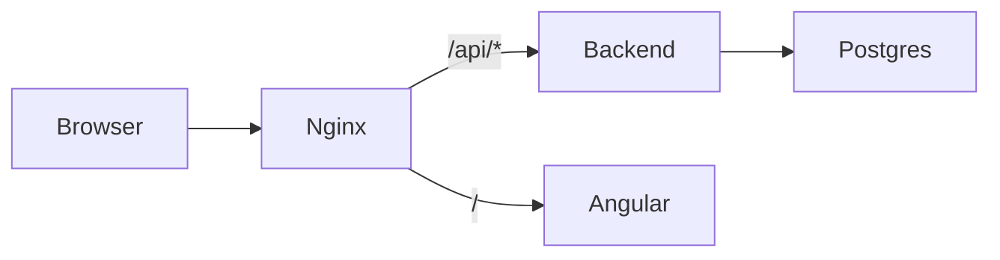

# SetupMatch

[](https://setupmatch.cloud)
[](LICENSE)

**SetupMatch** is open-source software for IT teams that need to track equipment inventory and assign full kits to employees. Register laptops, monitors, docks, and accessories, define role-based policies, and run global matching that picks the best complete kit from available stock.

**Live product site:** [setupmatch.cloud](https://setupmatch.cloud)

## Why SetupMatch

Spreadsheets break down as headcount grows. SetupMatch gives operations teams one place to:

- see what is available, reserved, assigned, or retired
- define kit policies per role or department
- match new hires to hardware with condition and brand rules
- confirm or cancel allocations without losing inventory truth

## Features

| Area | What you get |
|------|----------------|
| **Inventory** | Register equipment, filter by type and state, retire units |
| **Allocations** | Build a policy per employee, run matching, confirm or cancel |
| **Matching** | Global kit assignment (not greedy per-slot picking) with Hungarian algorithm |
| **States** | `available` → `reserved` → `assigned`, plus retire and cancel flows |

## Quick start

Requires Docker Desktop (or Docker Engine + Compose v2).

```powershell
git clone https://github.com/tomaszs/setupmatch.git
cd setupmatch
docker compose up --build
```

| Service | URL |
|---------|-----|
| Frontend (ops UI) | http://localhost:4200 |
| Backend API | http://localhost:8080 |
| Swagger UI | http://localhost:8080/swagger-ui.html |
| Postgres | localhost:5432 (user/password/db: `setupmatch`) |

Seed data loads automatically via Flyway (`V2__seed.sql`): 15 items across all equipment types.

Copy `.env.example` to `.env` to override compose defaults. Demo credentials only, not for production.

### Run tests locally

Backend (requires JDK 21 and Postgres). Easiest path: start test Postgres, then run Gradle in Docker:

```powershell
docker compose -f docker-compose.test.yml up -d --wait
docker run --rm -v "${PWD}/backend:/app" -w /app `
  -e SPRING_DATASOURCE_URL=jdbc:postgresql://host.docker.internal:5433/setupmatch `
  -e SPRING_DATASOURCE_USERNAME=setupmatch -e SPRING_DATASOURCE_PASSWORD=setupmatch `
  eclipse-temurin:21-jdk-alpine ./gradlew test --no-daemon
```

With JDK 21 on the host and Postgres on port 5432:

```powershell
cd backend
./gradlew test
```

Frontend unit tests (requires Node 22+):

```powershell
cd frontend
npm ci
npm test -- --watch=false --browsers=ChromeHeadless
```

E2E (requires the Docker stack running on http://localhost:4200):

```powershell
docker compose up -d --wait
cd e2e
npm ci
npx playwright install chromium
npm test
```

### Run frontend locally (optional)

Requires Node 22+ and a running backend (or Docker stack):

```powershell
cd frontend
npm install
npm start
```

With `ng serve`, configure a dev proxy or run the full Docker stack so `/api` resolves.

## Tech stack

| Layer | Technologies |
|-------|----------------|
| Backend | Kotlin, Java 21, Spring Boot 3.4, JPA, Flyway |
| Database | PostgreSQL 16 |
| Frontend | Angular 19, Angular Material |
| Infra | Docker Compose, nginx |
| Tests | JUnit, Karma, Playwright |

## Architecture



**Backend packages:** `allocation/` (pure Kotlin matcher), `domain/`, `service/`, `api/`, `config/`.

**Frontend routes:**

| Route | Purpose |
|-------|---------|
| `/inventory` | List, filter, register, retire equipment |
| `/allocations` | Allocation request list |
| `/allocations/new` | Policy builder |
| `/allocations/:id` | Detail, confirm/cancel |

Browser calls `/api/...`; nginx strips the prefix and forwards to Spring Boot.

## API summary

| Method | Path | Description |
|--------|------|-------------|
| POST | `/equipments` | Register equipment |
| GET | `/equipments` | List (`state`, `type`, `include_retired`) |
| POST | `/equipments/{id}/retire` | Retire available equipment |
| POST | `/allocations` | Create request and run allocator |
| GET | `/allocations` | List summaries |
| GET | `/allocations/{id}` | Full detail |
| POST | `/allocations/{id}/confirm` | Reserved → assigned |
| POST | `/allocations/{id}/cancel` | Release reserved equipment |

Errors: `{ "message": "...", "field_errors": { "field": "..." } }`.

**Auth:** intentionally omitted in v1 (single-operator demo).

## Allocation algorithm

SetupMatch assigns each policy slot exactly one distinct **available** unit:

- **Hard constraints:** type matches; `condition_score >= min_condition` when set
- **Soft scoring:** brand preference and purchase recency
- **Global:** each equipment item used at most once across all slots

The matcher uses the **Hungarian algorithm** in pure Kotlin (`HungarianAllocator`, no Spring dependency), parallelized by equipment type. Greedy per-slot picking can block later slots; global matching avoids partial kits.

## Contributing

Issues and pull requests are welcome on [GitHub](https://github.com/tomaszs/setupmatch). For product questions or hosted setup, use the [contact form](https://setupmatch.cloud/contact).

Please run backend and frontend tests before opening a PR. CI runs Gradle tests, Karma, Docker build, and Playwright E2E.

## Related repositories

| Repo | Purpose |
|------|---------|
| [tomaszs/setupmatch](https://github.com/tomaszs/setupmatch) | This app (inventory + allocation) |
| [tomaszs/setupmatch-web](https://github.com/tomaszs/setupmatch-web) | Marketing site at setupmatch.cloud |

## License

Proprietary. See [LICENSE](LICENSE). No use without prior written permission from Tomasz Smykowski.
